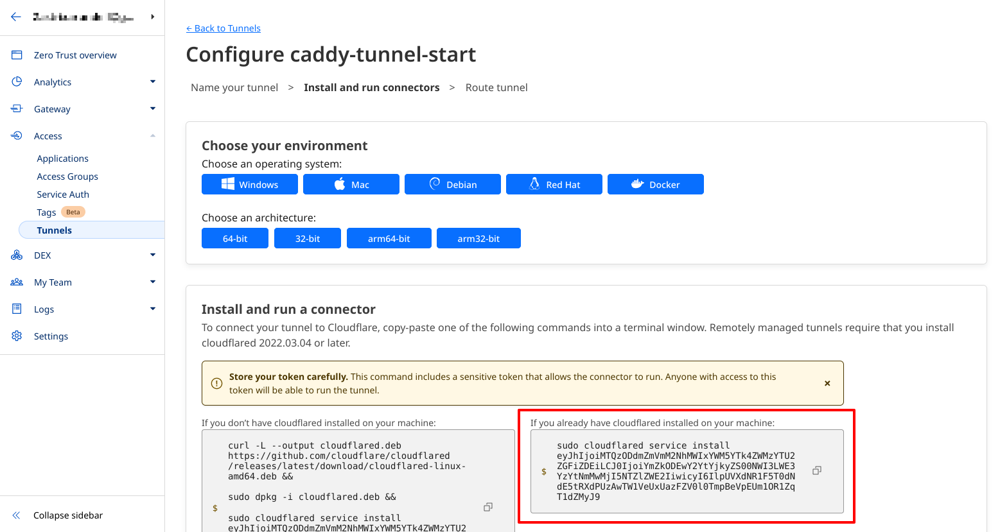
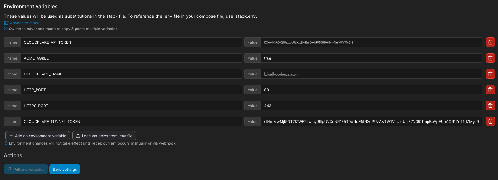
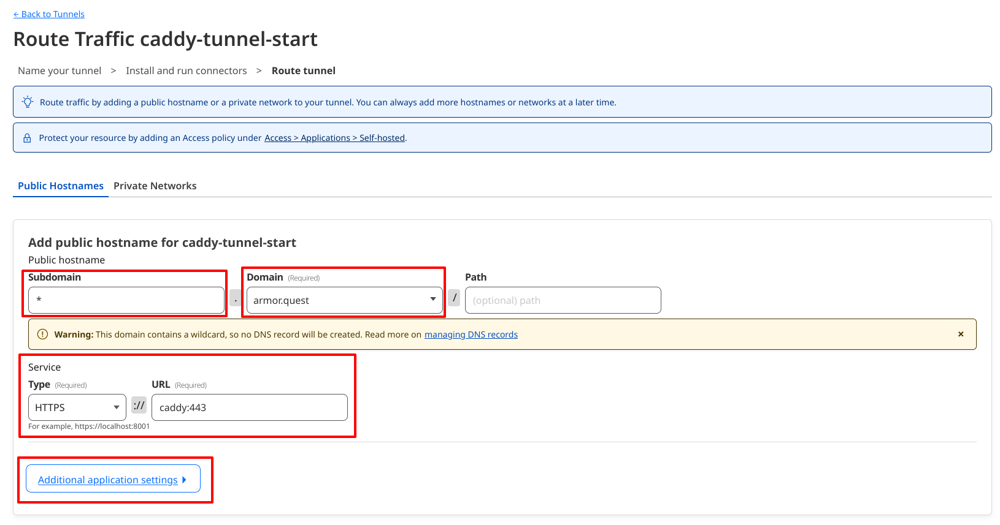
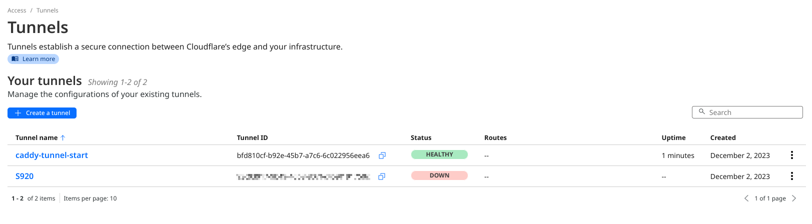
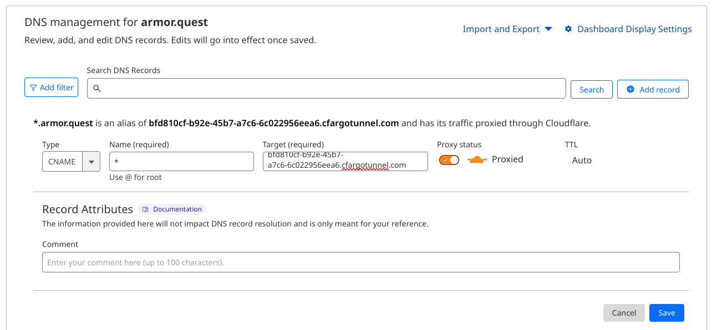
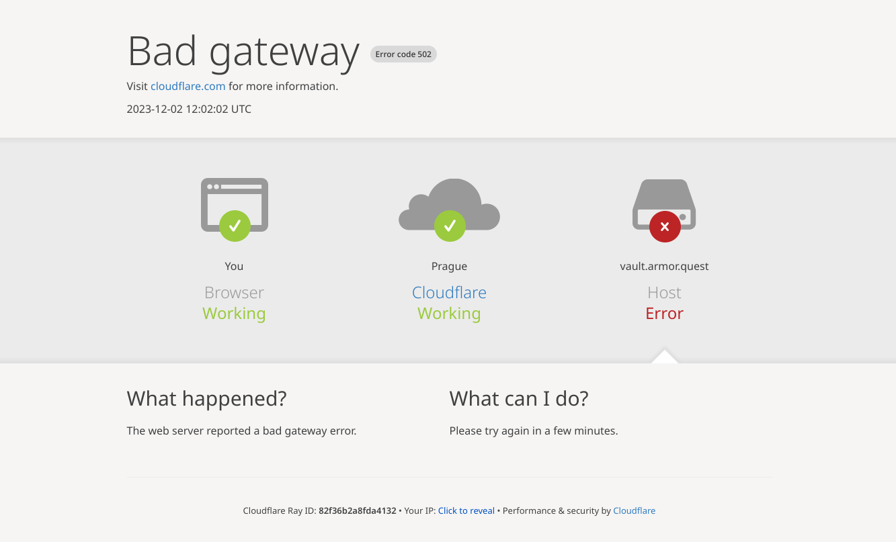
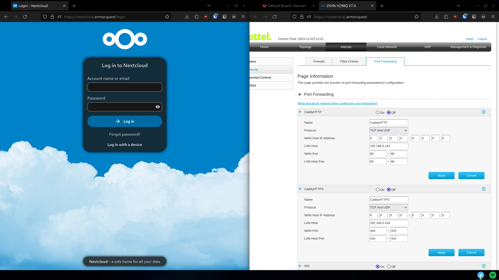

# Caddy cloudflare setup

This is a setup meant mostly for potainer. It's a setup I'm using personally that combines Caddy + Cloudflare DNS + Cloudflared tunnels for my websites.

The custom container is hosted as package on GitHub and it's supposed to build every 1st of a month, so you don't need to build caddy with xcaddy for this.

## How is it meant to work?

Essentially you add this as a git stack in portainer and set some environment variables and hopefully it should work with a wildcard domain. You will need to do some changes on your cloudflare dashboard though.

> [!IMPORTANT]
> If you're using a free Cloudflare account (as I am) you can only setup subdomain wildcards, not sub-subdomain wildcards.
> That means that `*.site.com` will work but `*.bar.site.com` won't. In case you really want something like sub-subdomains, you can use the `*.site.com` wildcard and then use the subdomain of `foo-bar.site.com`.

## Setting up cloudflare tunnels

On Cloudflare you can only setup remote-managed tunnels so you can't create a config file which sets everything up, meaning that you ***have*** to use the dashboard.

At the time of writing (<date>03/12/2025</date>) to access the remote tunnel page you have to go to `Zero Trust` > `Networks` > `Connectors`.

Let's start the tunnel creation process. Firstly, name your tunnel:


After that we need to get the tunnel token. Extract the token from the highlighted section:



Now set your `CLOUDFLARE_TUNNEL_TOKEN` env variable. I'm using portainer so I have a nice GUI for it:



Now we have to configure the Public Hostnames for our tunnel. Put in `*` for `Subdomains`, `Domain` should be your, well, domain. Don't worry about the warning, we'll take care of that later.

`Service.Type` should be `HTTPS` and `Service.URL` should be `caddy:443`. After that press `Additional application settings`:



After opening the new menu, head into `Additional application settings` > `TLS` > `Origin Server Name` and set it to the combination of your subdomain and domain, in my case: `*.armor.quest`:


Hit save and then you should see that your tunnel is active. If it's not, make sure it's started:



Now copy the ID of the tunnel, in my case: `bfd810cf-b92e-45b7-a7c6-6c022956eea6` and let's go to the DNS settings page for the domain. You need to create a `CNAME` record for `<id>.cfargotunnel.com`:



> [!IMPORTANT]
> Make sure proxy is enabled.

Now that you try to open your page... it doesn't work.



And the corresponding `cloudflared` logs are:

```
02T12:03:16Z ERR  error="Unable to reach the origin service. The service may be down or it may not be responding to traffic from cloudflared: remote error: tls: internal error" cfRay=82f36cf98a75b33f-PRG event=1 ingressRule=0 originService=https://caddy:443
2023-12-02T12:03:16Z ERR Request failed error="Unable to reach the origin service. The service may be down or it may not be responding to traffic from cloudflared: remote error: tls: internal error" connIndex=1 dest=https://vencloud.armor.quest/metrics event=0 ip=198.41.192.77 type=http
```

Well, it's because caddy isn't accepting the request. It gets it, it just declines it. We have to change up our Caddyfile a bit:

If this is our original Caddyfile:

```Caddy
(cloudflare) {
    encode gzip
    tls {
        dns cloudflare {env.CLOUDFLARE_API_TOKEN}
    }
}

service1.domain.xyz {
    import cloudflare
    root * /var/www/adblock/
	file_server browse
}

service2.domain.xyz {
    import cloudflare
    redir /admin* /
    reverse_proxy 192.168.0.143:8087
}

service3.domain.xyz {
    import cloudflare
    reverse_proxy 192.168.0.143:7951
}
```

We'll need to modify it to accept `*.domain.xyz` and then reverse proxy on every service (this has more boilerplate code but it's similar to standard a Caddyfile configs):

```Caddy
(cloudflare) {
    encode gzip
    tls {
        dns cloudflare {env.CLOUDFLARE_API_TOKEN}
    }
}

(service1) {
    root * /var/www/adblock/
	file_server browse
}

(service2) {
    redir /admin* /
    reverse_proxy 192.168.0.143:8087
}

(service3) {
    reverse_proxy 192.168.0.143:7951
}

*.domain.xyz {
	import cloudflare

	@service1 host service1.domain.xyz
	handle @service1 {
		import service1
	}

	@service2 host service2.domain.xyz
	handle @service2 {
		import service2
	}

    @service3 host service3.domain.xyz
	handle @service3 {
		import service3
	}
}
```


And with this Cloudflare should be communicating with the caddy server!

Now you should be able to access your websites without the ports actually being open.


